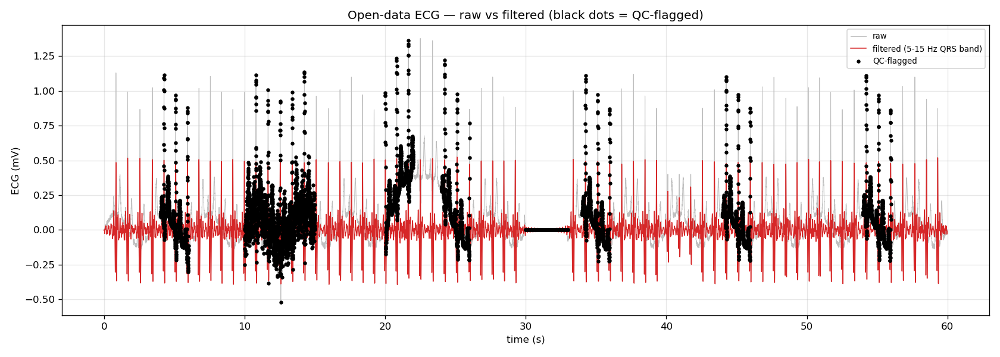

# Physio Data Platform

An automated pipeline for **physiological signal processing**: ingest → filter →
graph → analyze. Built for intraoperative monitoring data (ECG, blood pressure,
EEG, SpO₂, respiration), with signal-specific filtering, artifact detection,
and ML-augmented QC.

## Try it now (no credentials needed)

```bash
git clone https://github.com/Tiakat/physio-data-platform.git
cd physio-data-platform
pip install -r requirements.txt

# Run the full demo on open data (60 s ECG, ~10 seconds)
python tools/portfolio_demo.py --out docs/portfolio/
```

See [docs/portfolio/](docs/portfolio/) for example outputs: raw-vs-filtered
graphs, artifact detection detail views, and statistics.



## Architecture

```
┌──────────┐     ┌─────────────┐     ┌──────────────┐     ┌───────────┐     ┌────────────┐
│  Source  │────▶│    1-raw    │────▶│ 2-processed  │────▶│ 3-graphes │────▶│ 4-analysis │
│ (devices)│     │ (CSV, human │     │  (filtered,   │     │  (PNG per │     │ (stats +   │
│          │     │  readable)  │     │   QC flags)  │     │  signal)  │     │  ML models)│
└──────────┘     └─────────────┘     └──────────────┘     └───────────┘     └────────────┘
```

Four containers, one connected chain. Every derivative carries the source hash
"like an IP address" — full provenance from analysis back to the raw file.

## Key components

| Component | Description |
|-----------|-------------|
| `tools/signal_processing.py` | Signal-specific filtering engine (867 lines). Per-signal configs, never treats missing values as zero, preserves waveform morphology. |
| `tools/smart_filter.py` | ML-augmented artifact detection: Random Forest + self-supervised Transformer, with rule-based fallback. |
| `tools/open_data.py` | Open-data loader: synthetic ECG generator + PhysioNet MIT-BIH downloader. No credentials required. |
| `tools/portfolio_demo.py` | End-to-end demo: open data → QC → filter → graphs → stats. |
| `tools/build_1raw.py` | Ingest to `1-raw/` with exact patient-name validation. |
| `tools/pipeline_chain.py` | Automatic chain: `1-raw → 2-processed → 3-graphes → 4-analysis`. |
| `tools/supervisor.py` | Stage supervisors + continuity checks + meta-supervisor. |

## Signal coverage

50+ physiological signals with literature-backed normal ranges and artifact
patterns (`docs/signal_norms_labeling_ground_truth.md`):

- **Cardiac**: ECG, HR, ART (arterial pressure), NBP/NIBP
- **Respiratory**: SpO₂, RR, EtCO₂, airway pressure
- **Neurological**: BIS (bispectral index), EEG, NOL (nociception)
- **Other**: Temperature, infusion pump rates (propofol, remifentanil)

## Filtering principles

- **Signal-specific**: each signal gets its own filter (no generic Hampel-everything)
- **Transparent**: raw + filtered preserved side-by-side with full reproducibility log
- **Safe**: never treats missing as zero; never removes 100% of a signal;
  if >50% would be removed, retain original and flag for review
- **Physiological**: SpO₂ flat at 98–99% is normal (no smoothing); NBP gaps are
  expected (cuff intervals, never interpolated); pump data are exposures, not signals

## Machine learning

- **Supervised**: Random Forest per signal (artifact vs clean), trained on
  expert-labeled segments
- **Self-supervised**: Transformer pre-trained on unlabeled signals, fine-tuned
  for artifact detection
- **Unsupervised**: clustering for patient phenotyping
- **Comparison**: `tools/compare_models.py` benchmarks RF vs CNN vs Transformer vs SSL-Transformer

ML runs on filtered derivatives only — raw data is never modified by models.
The rule-based engine remains as the auditable baseline.

## Production deployment

In production, the pipeline runs on:
- **Azure Blob Storage**: 4 containers (`1-raw`, `2-processed`, `3-graphes`, `4-analysis`)
- **GitHub Actions**: weekday incremental ingest, full pipeline runs
- **Privacy**: containers are private; no patient data in the repo or CI artifacts

## Project structure

```
├── tools/               # Pipeline scripts (ingest, filter, graphs, ML, supervisors)
├── backbone/            # Device parsers (Infinity, BetterCare, BIS, NOL, pumps)
├── profiles/            # Per-project configurations (10 projects)
├── configs/signals/     # Per-signal filter configurations
├── docs/
│   ├── portfolio/       # Demo outputs (open data, safe to share)
│   └── signal_norms_*.md # Literature-backed signal norms
├── app/                 # Streamlit researcher dashboard
└── tests/               # Unit tests
```

## Documentation

- [Portfolio demo](docs/portfolio/) — run it yourself, see the outputs
- [Signal norms](docs/signal_norms_labeling_ground_truth.md) — 50 signals, literature-backed
- [Rules](docs/katia_rules.md) — pipeline requirements and conventions

## License

MIT — see LICENSE (if present). Open data demo uses the MIT-BIH Arrhythmia
Database from PhysioNet (Goldberger et al., 2000).
