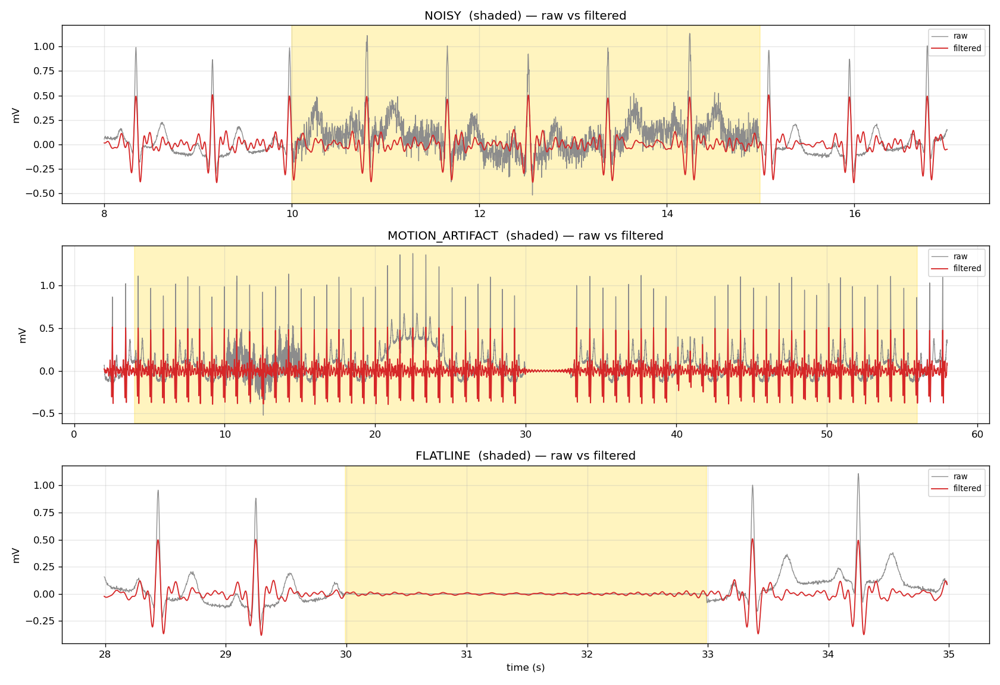

# Portfolio Demo: Open-Data ECG Pipeline

This demo runs the **real signal-processing pipeline** on **open data** — no
credentials, no private data, no cloud account required.

## What it demonstrates

| Stage | What happens |
|-------|--------------|
| **Ingest** | Load 60 s of ECG (synthetic, or MIT-BIH from PhysioNet) |
| **QC** | Rule-based artifact detection: flatline, saturation, muscle noise, motion |
| **Filter** | QRS-preserving bandpass filter (5–15 Hz) |
| **Graphs** | Raw-vs-filtered overview + per-artifact detail views |
| **Stats** | Per-segment statistics (mean/std/min/max, % flagged) |

## Run it

```bash
# Synthetic data (no internet, reproducible)
python tools/portfolio_demo.py --out docs/portfolio/

# Real open data from PhysioNet (needs: pip install wfdb)
python tools/portfolio_demo.py --out docs/portfolio/ --source mitdb --record 100
```

## Outputs

| File | Description |
|------|-------------|
| `ecg_graph.png` | Full 60 s: raw (grey) vs filtered (red), black dots = QC-flagged |
| `ecg_artifact_detail.png` | Zoomed views of each artifact class |
| `stats_summary.csv` | Per-segment statistics |
| `ecg_filtered_sample.csv` | Filtered data sample (1 Hz) |

## Example output




## Data sources

- **Synthetic**: `tools/open_data.py::synthetic_ecg()` — physiologically realistic
  ECG with P/QRS/T morphology, heart-rate variability, and injected artifacts.
- **MIT-BIH Arrhythmia Database** (optional): open-access ECG from PhysioNet.
  Goldberger et al. (2000). https://physionet.org/content/mitdb/1.0.0/

## Production use

In production, the same pipeline stages run on:
- `tools/build_1raw.py` — ingest to `1-raw/` (CSV, readable)
- `tools/signal_processing.py` — the full filtering engine (867 lines,
  signal-specific configs, never treats missing as zero)
- `tools/smart_filter.py` — ML-augmented artifact detection (RF + SSL Transformer)
- `tools/pipeline_chain.py` — automatic `1-raw → 2-processed → 3-graphes → 4-analysis`

See the main [README](../../README.md) for the full architecture.
